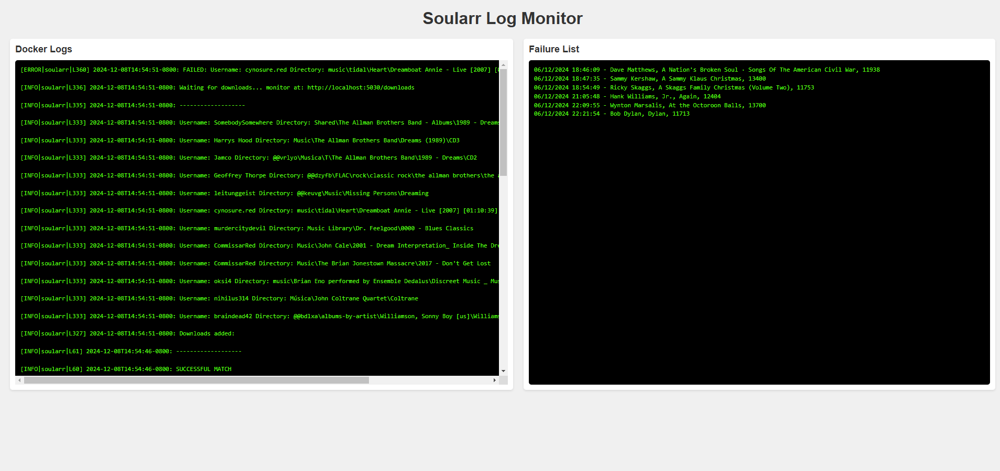

# Soularr Dashboard

A web interface that displays Soularr logs and failure list in real-time using a dual-window display.

## What it Does
- Shows Soularr logs in the left window (newest entries at top)
- Shows failure list in the right window
- Auto-refreshes every second
- Equal window sizing for easy viewing

## Requirements
- Docker and Docker Compose
- Soularr already installed and running
- Linux system (tested on Ubuntu)

## Quick Setup
1. Clone this repository to your Soularr directory
2. Add the dashboard service to your docker-compose.yml
3. Build and start the containers:

docker compose down
docker compose build dashboard
docker compose up -d

## Usage
Open your web browser and go to:
http://your-server-ip:8080

## License
This project is licensed under the MIT License - see the LICENSE.txt file for details
