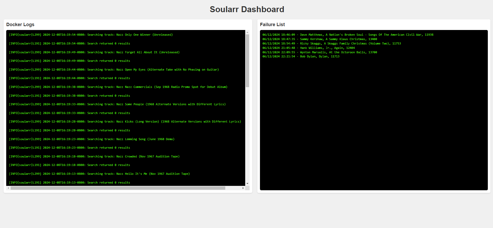

# Soularr Dashboard

A web interface that displays Soularr logs and failure list in real-time using a dual-window display.

## What it Does
- Shows Soularr logs in the left window (newest entries at top)
- Shows failure list in the right window
- Auto-refreshes every second
- Equal window sizing for easy viewing
- Real-time log monitoring
- Failed import tracking
- Clean, responsive web interface
- Docker-based deployment
- Automatic log rotation
- Configurable logging levels

## Requirements
- Docker and Docker Compose
- Soularr already installed and running
- Linux system (tested on Ubuntu)
- Port 8080 available

## Directory Structure
/home/<user>/Soularr/
├── data/
│   └── logs/
│       └── soularr.log
├── dashboard/
│   ├── templates/
│   ├── dashboard.py
│   ├── Dockerfile
│   └── requirements.txt
├── docker-compose.yml
└── config.ini

## Quick Setup
1. Clone this repository to your Soularr directory
2. Add the dashboard service to your docker-compose.yml
3. Build and start the containers:

docker compose down
docker compose build dashboard
docker compose up -d

## Logging
Logs are stored in the `/data/logs` directory, which maps to `/home/<user>/Soularr/data/logs` on the host system. The main log file is `soularr.log`.

### Log Configuration
- Logs are automatically created in the specified directory
- Docker handles log rotation (10MB max size, keeps 3 files)
- Log path can be configured in config.ini
- Dashboard automatically monitors and displays the latest logs

## Usage
Open your web browser and go to:
http://your-server-ip:8080

## Configuration
See INSTALL.md for detailed configuration options and setup instructions.

## Contributing
Contributions are welcome! Please feel free to submit a Pull Request.

## Support
If you encounter any issues or need help, please open an issue on GitHub.

## License
This project is licensed under the MIT License - see the LICENSE.txt file for details

## Acknowledgments
- Soularr project team
- Flask-SocketIO contributors
- Docker

